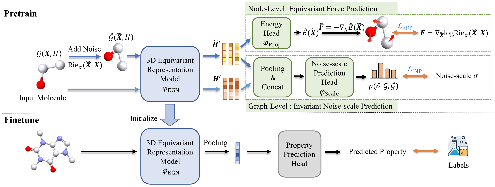

# Energy-Motivated Equivariant Pretraining for 3D Molecular Graphs (AAAI 2023)

Code for Energy-Motivated Equivariant Pretraining for 3D Molecular Graphs (3D-EMGP).

[](https://github.com/jiaor17/3D-EMGP/blob/main/LICENSE)   [**[Paper]**](https://arxiv.org/pdf/2207.08824.pdf)



## Dependencies

```
python==3.7.10
torch==1.7.0
torch-geometric==1.6.3
```

## Data Preparation

The raw data of GEOM can be downloaded from [the official website](https://dataverse.harvard.edu/dataset.xhtml?persistentId=doi:10.7910/DVN/JNGTDF).

One can download the dataset and unpack it into the `dataset` folder as follows:

```
|-- datasets
    |-- GEOM
	|-- rdkit_folder
            |-- drugs
            |-- qm9
            |-- summary_drugs.json
            |-- summary_qm9.json
```

To preprocess the GEOM data for pretraining:

```
python data/geom.py --base_path datasets/GEOM/rdkit_folder/ --datasets qm9 --output blocks --val_num 500 --conf_num 10 --block_size 100000 --test_smiles data/filter_smiles.txt
```

Generated data blocks are listed as follows:

```
|-- datasets
    |-- GEOM
        |-- rdkit_folder
        |-- blocks
            |-- summary.json
            |-- val_block.pkl
            |-- train_block_i.pkl
```

## Pretraining

3D-EMGP pretraining can be conducted via the following commands.

```shell
export CUDA_VISIBLE_DEVICES=0
python -u script/pretrain_3dmgp.py --config_path config/pretrain_3dmgp.yml
```

One can also pretrain the model in a multi-GPU mode.

```shell
export CUDA_VISIBLE_DEVICES=0,1,2,3
python -m torch.distributed.launch --nproc_per_node=4 --master_port <port> script/pretrain_3dmgp.py --config_path config/pretrain_3dmgp.yml
```

The pretrained model will be saved in `checkpoints/pretrain/3dmgp`, which can be modified in `config/pretrain_3dmgp.yml`

One can also pretrain the 3D model via the re-implemented baseline methods via the following commands. Take AttrMask as an example:

```shell
export CUDA_VISIBLE_DEVICES=0
python -u script/baselines/train_attr_mask.py --config_path config/pretrain_baselines.yml
```

## Finetuning

Finetuning on QM9 :

```
python -u script/finetune_qm9.py --config_path config/finetune_qm9.yml --restore_path <pretrained_checkpoint> --property <property>
```

The property should be chosen from

```
alpha, gap, homo, lumo, mu, Cv, G, H, r2, U, U0, zpve
```

Finetuning on MD17 :

```
python -u script/finetune_md17.py --config_path config/finetune_md17.yml --restore_path <pretrained_checkpoint> --molecule <molecule> --model_name <molecule>
```

The molecule should be chosen from

```
aspirin
benzene
ethanol
malonaldehyde
naphthalene
salicylic_acid
toluene
uracil
```

Note that the finetuning datasets will be automatically downloaded and preprocessed on the first run.

## Citation

Please consider citing our work if you find it helpful:

```
@misc{jiao2022energy,
  url={https://arxiv.org/abs/2207.08824},
  author={Jiao, Rui and Han, Jiaqi and Huang, Wenbing and Rong, Yu and Liu, Yang},
  title={Energy-Motivated Equivariant Pretraining for 3D Molecular Graphs},
  publisher={arXiv},
  year={2022}
}
```

